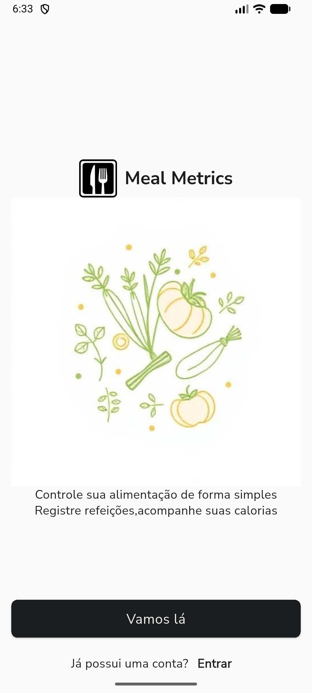
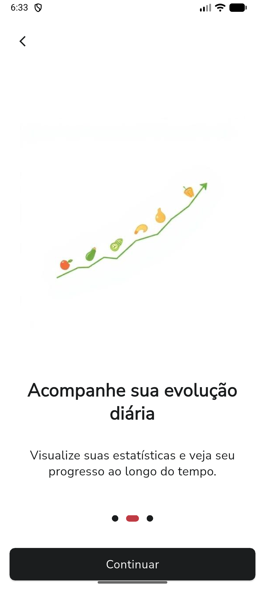

# MealMetrics

  
  
  
  
  

MealMetrics é um aplicativo de nutrição desenvolvido para ajudar o usuário a controlar as calorias ingeridas ao longo do dia. Com uma interface intuitiva, o app permite registrar refeições, acompanhar o consumo calórico diário e visualizar o progresso nutricional de forma simples e prática.

## Funcionalidades principais
- Cadastro de refeições e alimentos consumidos
- Cálculo automático das calorias ingeridas
- Histórico diário de consumo calórico
- Gráficos e relatórios para acompanhamento do progresso
- Interface amigável e fácil de usar

## Objetivo
O objetivo do MealMetrics é proporcionar ao usuário um maior controle sobre sua alimentação, auxiliando na adoção de hábitos mais saudáveis e no alcance de metas nutricionais.

## Tecnologias utilizadas
- Flutter
- Dart
- Suporte multiplataforma (Android, iOS, Web, Desktop)

## Como contribuir
Sinta-se à vontade para abrir issues ou enviar pull requests com sugestões de melhorias, correções de bugs ou novas funcionalidades.

---
Desenvolvido por ArturAfonso
# mealmetrics

A new Flutter project.

## Getting Started

This project is a starting point for a Flutter application.

A few resources to get you started if this is your first Flutter project:

- [Lab: Write your first Flutter app](https://docs.flutter.dev/get-started/codelab)
- [Cookbook: Useful Flutter samples](https://docs.flutter.dev/cookbook)

For help getting started with Flutter development, view the
[online documentation](https://docs.flutter.dev/), which offers tutorials,
samples, guidance on mobile development, and a full API reference.
